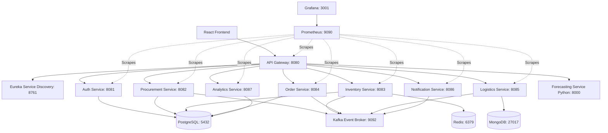

# Enterprise ERP Supply Chain - Deployment Runbook

## 1. Deployment Architecture Diagram
*(Draft outline. [TODO: confirm after integration testing] which connections were actually used vs. planned)*



## 2. Prerequisites
- Docker & Docker Compose installed
- Minikube and `kubectl` (if deploying to K8s)
- **[TODO: confirm after integration testing]** Any specific Java/Maven local requirements or Node versions required by teammates.

## 3. Environment Setup
1. Copy the example environment file:
   ```bash
   cp .env.example .env
   ```
2. Fill in the required credentials and secrets in `.env`.
3. **[TODO: confirm after integration testing]** Whether any specific new environment variables or keys had to be added to `.env` today.

## 4. One-Command Startup
Bring up the entire ecosystem locally:
```bash
docker-compose up -d --build
```
**[TODO: confirm after integration testing]** If any services needed to be started sequentially due to race conditions (e.g., bringing up DB/Kafka first, waiting, then bringing up microservices).

## 5. Health-Check Verification
Run the smoke test script to verify all services are `UP`:
```bash
./smoke-test.sh
```
Verify the following UI dashboards are accessible:
- **Eureka**: `http://localhost:8761`
- **Grafana**: `http://localhost:3001` (admin/admin)
- **Frontend**: `http://localhost:3000`

**[TODO: confirm after integration testing]** If any ports had to be adjusted to avoid local conflicts.

## 6. Common Failure Points & Troubleshooting
1. **Service Discovery Timing Race**: The API Gateway boots up, but Eureka hasn't finished registering services yet. 
   - *Fix*: Restart the Gateway `docker-compose restart api-gateway`, or wait 30 seconds for the Eureka cache to sync.
2. **Kafka Topic Auto-Creation Disabled**: Services crash on startup because they try to consume a topic that doesn't exist yet, and auto-create is off.
   - *Fix*: Ensure `spring.kafka.admin.auto-create=true` is set.
3. **DB Connection Refused**: A Spring Boot service tries to connect to PostgreSQL before it's ready.
   - *Fix*: Check `docker-compose logs postgres` to ensure it's actually ready to accept connections.
4. **CORS on the API Gateway**: The React frontend is blocked from making requests.
   - *Fix*: Ensure Gateway has global CORS configured allowing `localhost:3000`.

**[TODO: confirm after integration testing]** Any *new* failure points discovered during today's session.

## 7. Minikube Deployment
1. Start Minikube: 
   ```bash
   minikube start
   ```
2. Build images into the Minikube daemon:
   ```bash
   eval $(minikube docker-env)
   docker-compose build
   ```
3. Apply infrastructure manifests:
   ```bash
   kubectl apply -f k8s-manifests/infrastructure.yaml
   ```
4. Apply service manifests:
   ```bash
   kubectl apply -f k8s-manifests/services.yaml
   ```
   
**[TODO: confirm after integration testing]** If Kubernetes startup required adding `InitContainers` to handle dependency order (like waiting for Kafka and Postgres), or if the default K8s crash-loop backoff handled it fine natively.
