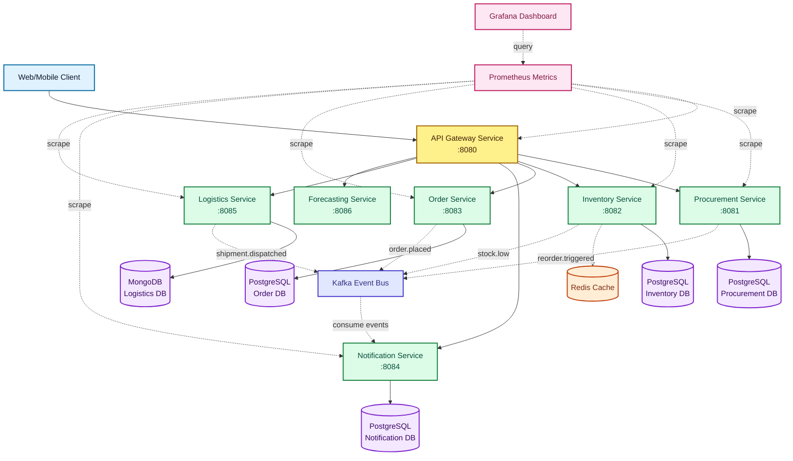

# Deployment Architecture

```mermaid
flowchart TD
    %% Define Styles
    classDef client fill:#e0f2fe,stroke:#0369a1,stroke-width:2px,color:#0f172a
    classDef gateway fill:#fef08a,stroke:#a16207,stroke-width:2px,color:#422006
    classDef service fill:#dcfce7,stroke:#15803d,stroke-width:2px,color:#064e3b
    classDef db fill:#f3e8ff,stroke:#7e22ce,stroke-width:2px,color:#3b0764
    classDef cache fill:#ffedd5,stroke:#c2410c,stroke-width:2px,color:#7c2d12
    classDef broker fill:#e0e7ff,stroke:#4338ca,stroke-width:2px,color:#312e81
    classDef monitor fill:#fce7f3,stroke:#be185d,stroke-width:2px,color:#831843

    %% External
    Client[Web/Mobile Client]:::client

    %% Gateway
    Gateway[API Gateway Service\n:8080]:::gateway

    %% Microservices
    ProcurementService[Procurement Service\n:8081]:::service
    InventoryService[Inventory Service\n:8082]:::service
    OrderService[Order Service\n:8083]:::service
    NotificationService[Notification Service\n:8084]:::service
    LogisticsService[Logistics Service\n:8085]:::service
    ForecastingService[Forecasting Service\n:8086]:::service

    %% Databases
    ProcurementDB[(PostgreSQL\nProcurement DB)]:::db
    InventoryDB[(PostgreSQL\nInventory DB)]:::db
    OrderDB[(PostgreSQL\nOrder DB)]:::db
    NotificationDB[(PostgreSQL\nNotification DB)]:::db
    LogisticsDB[(MongoDB\nLogistics DB)]:::db

    %% Cache & Event Bus
    RedisCache[(Redis Cache)]:::cache
    Kafka[Kafka Event Bus]:::broker

    %% Monitoring
    Grafana[Grafana Dashboard]:::monitor
    Prometheus[Prometheus Metrics]:::monitor

    %% Connections - Client to Gateway
    Client --> Gateway

    %% Connections - Gateway to Services
    Gateway --> ProcurementService
    Gateway --> InventoryService
    Gateway --> OrderService
    Gateway --> NotificationService
    Gateway --> LogisticsService
    Gateway --> ForecastingService

    %% Connections - Services to DBs
    ProcurementService --> ProcurementDB
    InventoryService --> InventoryDB
    OrderService --> OrderDB
    NotificationService --> NotificationDB
    LogisticsService --> LogisticsDB

    %% Connections - Cache
    InventoryService -.-> RedisCache

    %% Connections - Event Bus
    OrderService -.->|order.placed| Kafka
    InventoryService -.->|stock.low| Kafka
    LogisticsService -.->|shipment.dispatched| Kafka
    ProcurementService -.->|reorder.triggered| Kafka
    Kafka -.->|consume events| NotificationService

    %% Connections - Monitoring
    Prometheus -.->|scrape| Gateway
    Prometheus -.->|scrape| ProcurementService
    Prometheus -.->|scrape| InventoryService
    Prometheus -.->|scrape| OrderService
    Prometheus -.->|scrape| NotificationService
    Prometheus -.->|scrape| LogisticsService
    Grafana -.->|query| Prometheus
```
