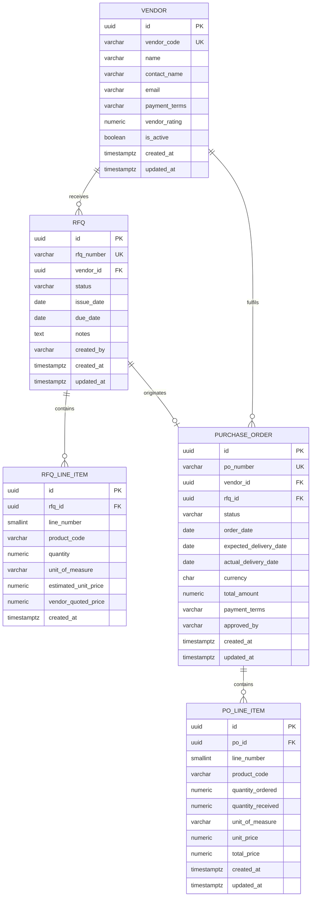
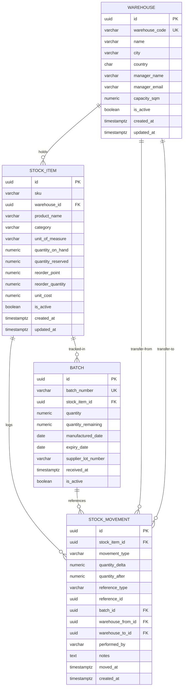
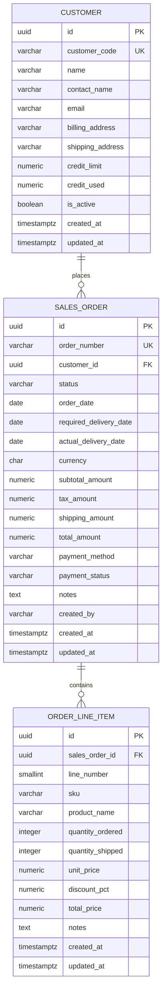
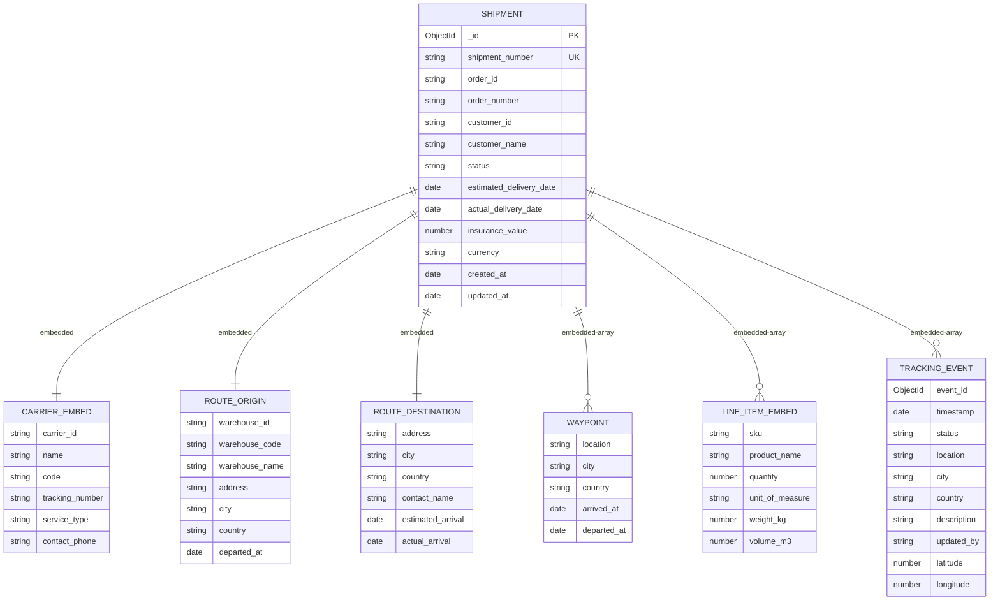
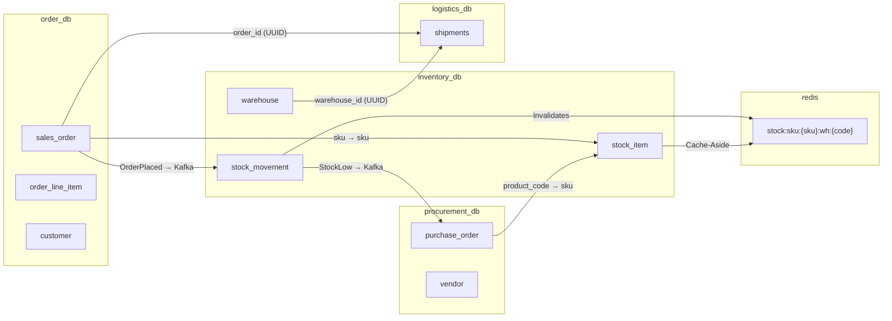

# Schema Diagrams
## Enterprise ERP Supply Chain Transformation
**Author:** Misba — Database Engineer
**Scope:** Procurement, Inventory, Order, Logistics (Notification Service removed per Avani's ownership)

---

## 1. Procurement Service (PostgreSQL — `procurement_db`)



---

## 2. Inventory Service (PostgreSQL — `inventory_db`)



---

## 3. Order Service (PostgreSQL — `order_db`)



---

## 4. Logistics Service (MongoDB — `logistics_db.shipments`)



---

## 5. System-Wide Cross-Service Data Flow



---

## 6. Flyway Migration File Map

```
procurement-service/src/main/resources/db/migration/
├── V1__init_schema.sql      ← vendor, rfq, rfq_line_item, purchase_order, po_line_item
├── V2__add_indexes.sql      ← All indexes + vw_vendor_performance + vw_monthly_spend
└── V3__seed_data.sql        ← 5 vendors, 8 RFQs, 10 POs, 20 PO lines

inventory-service/src/main/resources/db/migration/
├── V1__init_schema.sql      ← warehouse, stock_item, batch, stock_movement
├── V2__add_indexes.sql      ← All indexes + vw_inventory_turnover + vw_stock_snapshot
└── V3__seed_data.sql        ← 3 warehouses, 15 SKUs, 30 batches, 25 movements

order-service/src/main/resources/db/migration/
├── V1__init_schema.sql      ← customer, sales_order, order_line_item
├── V2__add_indexes.sql      ← All indexes + vw_order_fulfillment_rate + vw_customer_revenue
└── V3__seed_data.sql        ← 8 customers, 20 sales orders, 29 order lines

logistics-service/mongodb/
├── schema_design.md         ← Full document structure + design decisions
├── indexes.js               ← createIndex() calls for all 10 indexes
└── seed_data.js             ← 15 shipment documents with tracking events

analytics/sql/
└── reporting_views.sql      ← 7 cross-service views: OTIF, turnover, vendor KPIs, etc.

inventory-service/src/main/resources/
└── redis-cache-strategy.md  ← Key patterns, TTLs, cache-aside, invalidation logic
```
